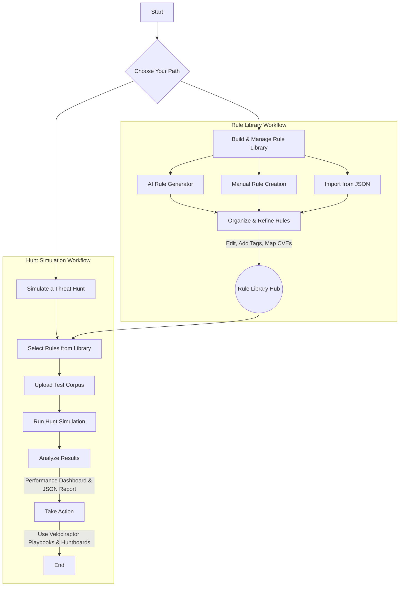

# 🛡️ OpenYARA-Hunt: Interactive Threat Hunting Command Center

[](https://opensource.org/licenses/Apache-2.0)
[](CONTRIBUTING.md)
[](http://makeapullrequest.com)

**OpenYARA-Hunt** is a powerful, browser-based interface for the entire YARA rule lifecycle. Designed for threat hunters, DFIR analysts, and security engineers, this application streamlines the creation, testing, management, and deployment of YARA rules. It combines a rich rule library, an AI-powered generator, and a sophisticated hunt simulator into a single, intuitive platform.

---

## ✨ Key Features

-   **Centralized Rule Library**: Manage your YARA rules with advanced filtering by category, custom tags, and CVE identifiers. Features like manual creation, editing, import/export, and robust search make it a powerful threat intelligence database.
-   **AI-Assisted Rule Generation**: Leverage the Google Gemini API to instantly generate high-quality YARA rules from natural language threat descriptions. Go from concept to a deployable, validated rule in seconds.
-   **Threat Hunt Simulator**: Test and validate your rules against a file corpus before deployment. The simulator provides immediate feedback, a detailed JSON report of matches, and visualizes key performance metrics.
-   **Performance Dashboard**: After a hunt, analyze the results with a dashboard showing metrics like Precision, Recall, F1-Score, and False Positive Rate to understand rule effectiveness.
-   **Built-in Rule Validation**: An integrated syntax checker validates rules on save and provides warnings for AI-generated rules, ensuring the integrity and reliability of your ruleset.
-   **Integrated Forensic Playbooks**: Access ready-to-use Velociraptor playbooks and huntboard templates directly within the application to guide your incident response operations.
-   **Save/Load Configurations**: Save your hunt configurations (selected rules) to your browser's local storage for quick access in future sessions.

---

## 🚀 Application Workflow

This flowchart illustrates the core user journey within OpenYARA-Hunt, from building your rule library to analyzing hunt results and taking action.


---

## 🛠️ Technology Stack

-   **Frontend**: React 19, TypeScript
-   **Build Tool**: Vite
-   **Styling**: Tailwind CSS
-   **AI Integration**: Google Gemini API
-   **Icons**: Lucide React
-   **Charts**: Recharts

---

## 💻 Running Locally: A Step-by-Step Guide

This project is built with Vite and requires Node.js to run the development server. Follow these steps to get the application running on your local machine.

### Step 1: Prerequisites

Before you begin, ensure you have the following software installed:

1.  **A modern web browser** (e.g., Chrome, Firefox, Edge)
2.  **Git** - To clone the project files from GitHub
    -   [Download Git here](https://git-scm.com/downloads)
3.  **Node.js (v18 or higher) and npm** - Required to install dependencies and run the development server
    -   [Download Node.js here](https://nodejs.org/) (npm is included with Node.js)

### Step 2: Get the Project Code

Open your terminal and run the following commands:
```bash
# Clone the repository from GitHub
git clone https://github.com/your-username/OpenYARA-Hunt.git

# Navigate into the project folder
cd OpenYARA-Hunt
```
*(Replace `your-username` with the actual GitHub username)*

### Step 3: Install Dependencies

Install all required packages:
```bash
npm install
```

### Step 4: Set Up the Gemini API Key (Optional)

> **IMPORTANT:** The Gemini API key is **only required for the "AI Rule Generator" feature.** 
> All other features (rule library, hunt simulator, playbooks) work perfectly without it.

To use the AI generator, you need to provide your Google Gemini API key using an environment file.

1.  Get your API key from [Google AI Studio](https://aistudio.google.com/app/apikey).
2.  In the project's root directory (the same folder as `package.json`), create a new file named `.env.local`.
3.  Inside your new `.env.local` file, add the following line, replacing the placeholder with your actual key. **The `VITE_` prefix is mandatory.**

    ```
    # .env.local
    VITE_GEMINI_API_KEY="YOUR_ACTUAL_API_KEY_GOES_HERE"
    ```
    
4.  Restart the development server (`npm run dev`) if it's already running. Vite will automatically pick up the new file.

### ⚠️ **Critical Security Warning** ⚠️

This method embeds your API key directly into the client-side application code. This is convenient for local development but **highly insecure for a public-facing website.** Anyone who visits your site can inspect the code and steal your API key, potentially leading to unauthorized use and billing charges.

**For a production application, you MUST protect this key by using a backend proxy.** The client should make requests to your own server, and your server would then securely make the call to the Gemini API.

The `.env.local` file is included in `.gitignore` to prevent your key from being committed to version control.

### Step 5: Start the Development Server

Launch the application:
```bash
npm run dev
```

The Vite development server will start and compile your code.

### Step 6: Open the Application

Open your browser and navigate to:
```
http://localhost:3000
```

The OpenYARA-Hunt application should now be running!

---

## 🔧 Build for Production

To create an optimized production build:
```bash
npm run build
```

The built files will be in the `dist/` directory. You can preview the production build locally:
```bash
npm run preview
```

---

## 🤝 Contributing

Contributions from the community are welcome and encouraged! Whether you're submitting a new YARA rule, improving a playbook, or enhancing the code, your help is appreciated.

Please read our [**CONTRIBUTING.md**](CONTRIBUTING.md) for guidelines on how to get started.

---

## 📜 License

This project is licensed under the **Apache 2.0 License**. See the `LICENSE` file for details.