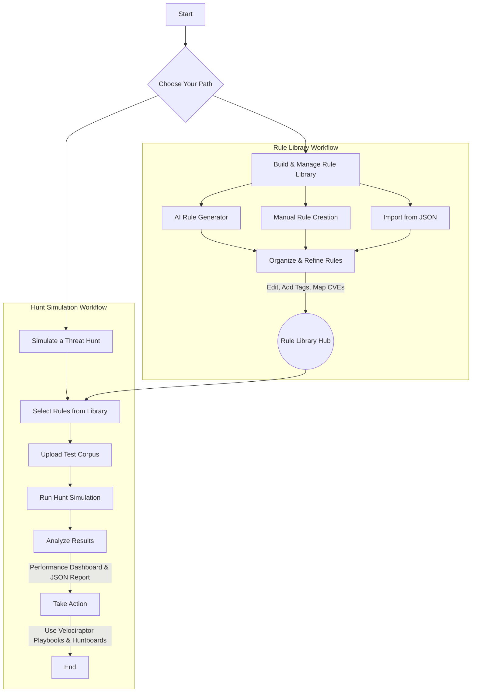

# 🛡️ OpenYARA-Hunt: Interactive Threat Hunting Command Center

[](https://opensource.org/licenses/Apache-2.0)
[](CONTRIBUTING.md)
[](http://makeapullrequest.com)

**OpenYARA-Hunt** is a powerful, browser-based interface for the entire YARA rule lifecycle. Designed for threat hunters, DFIR analysts, and security engineers, this application streamlines the creation, testing, management, and deployment of YARA rules. It combines a rich rule library, an AI-powered generator, and a sophisticated hunt simulator into a single, intuitive platform.

---

## Key Features

-   **Centralized Rule Library**: Manage your YARA rules with advanced filtering by category, custom tags, and CVE identifiers. Features like manual creation, editing, import/export, and robust search make it a powerful threat intelligence database.
-   **Secure AI-Assisted Rule Generation**: Leverage the Google Gemini API via a secure backend proxy to instantly generate high-quality YARA rules from natural language threat descriptions. The API key is never exposed to the client.
-   **Threat Hunt Simulator**: Test and validate your rules against a file corpus before deployment. The simulator provides immediate feedback, a detailed JSON report of matches, and visualizes key performance metrics.
-   **Performance Dashboard**: After a hunt, analyze the results with a dashboard showing metrics like Precision, Recall, F1-Score, and False Positive Rate to understand rule effectiveness.
-   **Built-in Rule Validation**: An integrated syntax checker validates rules on save and provides warnings for AI-generated rules, ensuring the integrity and reliability of your ruleset.
-   **Integrated Forensic Playbooks**: Access ready-to-use Velociraptor playbooks and huntboard templates directly within the application to guide your incident response operations.
-   **Save/Load Configurations**: Save your hunt configurations (selected rules) to your browser's local storage for quick access in future sessions.

---

## 🚀 Application Workflow

This flowchart illustrates the core user journey within OpenYARA-Hunt, from building your rule library to analyzing hunt results and taking action.


## Technology Stack

-   **Frontend**: React 19, TypeScript
-   **Backend Proxy**: Serverless Function (e.g., Cloudflare Workers, Vercel Functions)
-   **Build Tool**: Vite
-   **Styling**: Tailwind CSS
-   **AI Integration**: Google Gemini API
-   **Icons**: Lucide React
-   **Charts**: Recharts

---

## Running & Deploying Securely

This project is built with Vite and includes a backend proxy function to protect your Gemini API key.

### Step 1: Prerequisites

-   A modern web browser (e.g., Chrome, Firefox, Edge)
-   Git: [Download here](https://git-scm.com/downloads)
-   Node.js (v18 or higher) and npm: [Download here](https://nodejs.org/)

### Step 2: Get the Project Code

```bash
# Clone the repository
git clone https://github.com/your-username/OpenYARA-Hunt.git

# Navigate into the project folder
cd OpenYARA-Hunt
```

### Step 3: Install Dependencies

```bash
npm install
```

### Step 4: Running Locally (With AI Generator)

For local development, the application makes direct calls to the Gemini API from your browser. To configure this, you must provide your API key via an environment variable.

1.  **Obtain a Gemini API Key:**
    Visit [Google AI Studio](https://aistudio.google.com/app/apikey) to get your API key.

2.  **Create a local environment file:**
    Once you run the `npm install`, a file named `.env.local` will be created in the root of the project 

3.  **Add your API key to the file:**
    Open `.env.local` and add the following line, replacing `your_gemini_api_key_here` with your actual key:
    ```
    API_KEY=your_gemini_api_key_here
    ```
    You can use any of the text editors like `Sublime Text`, `Notepad++`, or `VS Code` whichever you feel comfortable with.

4.  **Run the dev server:**
    ```bash
    npm run dev
    ```
    Open your browser to the local URL provided (e.g., `http://localhost:5173`).


### Step 5: Deploying for Full Functionality (Recommended)

To protect your API key in production, you must deploy the application to a platform that supports serverless functions (like Cloudflare Pages, Vercel, or Netlify).

Here are example instructions for **Cloudflare Pages**:

1.  **Push to GitHub**: Fork this repository and push it to your own GitHub account.
2.  **Create a Cloudflare Pages Project**:
    -   Log in to your Cloudflare dashboard.
    -   Go to **Workers & Pages** > **Create application** > **Pages** > **Connect to Git**.
    -   Select your forked repository.
3.  **Configure the Build**:
    -   **Project name**: Choose a name for your project.
    -   **Production branch**: Select `main`.
    -   **Framework preset**: Select `Vite`. Cloudflare will automatically detect the correct build settings (`npm run build`) and output directory (`dist`).
4.  **Add Your Secure API Key**:
    -   Go to **Settings** > **Environment variables**.
    -   Under **Production**, click **Add variable**.
    -   **Variable name**: `GEMINI_API_KEY`
    -   **Value**: Paste your actual Google Gemini API key here.
    -   Click **Save**.
5.  **Deploy**: Go back to your deployment and click **Save and Deploy**.

Once deployed, your application will have a public URL, and the AI Rule Generator will work securely by calling the backend proxy function you just configured.

---

## 🔧 Build for Production

To create an optimized production build locally:
```bash
npm run build
```
The built files will be in the `dist/` directory.

---

## Contributing

Contributions from the community are welcome and encouraged! Please read our [**CONTRIBUTING.md**](CONTRIBUTING.md) for guidelines on how to get started.

---

## License

This project is licensed under the **Apache 2.0 License**. See the `LICENSE` file for details.

