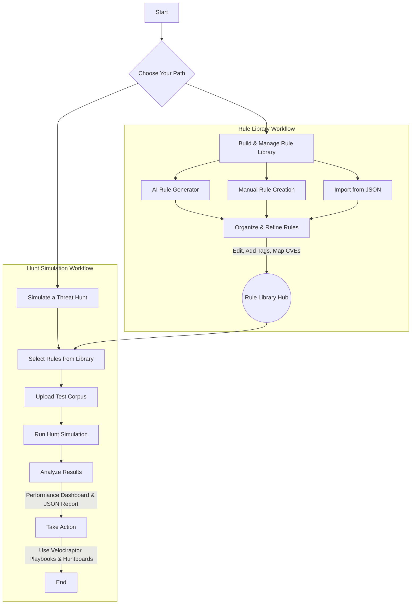

# 🛡️ OpenYARA-Hunt: Interactive Threat Hunting Command Center

[](https://opensource.org/licenses/Apache-2.0)
[](CONTRIBUTING.md)
[](http://makeapullrequest.com)

**OpenYARA-Hunt** is a powerful, web-based interface for the entire YARA rule lifecycle. Designed for threat hunters, DFIR analysts, and security engineers, this application streamlines the creation, testing, management, and deployment of YARA rules. It combines a rich rule library, an AI-powered generator, and a sophisticated hunt simulator into a single, intuitive platform.

---

## 🚀 Application Workflow

This flowchart illustrates the core user journey within OpenYARA-Hunt, from building your rule library to analyzing hunt results and taking action.



---

## ✨ Key Features

-   **Centralized Rule Library**: Manage your YARA rules with advanced filtering by category, custom tags, and CVE identifiers. Features like manual creation, editing, import/export, and robust search make it a powerful threat intelligence database.
-   **AI-Assisted Rule Generation**: Leverage the Google Gemini API to instantly generate high-quality YARA rules from natural language threat descriptions. Go from concept to a deployable, validated rule in seconds.
-   **Threat Hunt Simulator**: Test and validate your rules against a file corpus before deployment. The simulator provides immediate feedback, a detailed JSON report of matches, and visualizes key performance metrics.
-   **Performance Dashboard**: After a hunt, analyze the results with a dashboard showing metrics like Precision, Recall, F1-Score, and False Positive Rate to understand rule effectiveness.
-   **Built-in Rule Validation**: An integrated syntax checker validates rules on save and provides warnings for AI-generated rules, ensuring the integrity and reliability of your ruleset.
-   **Integrated Forensic Playbooks**: Access ready-to-use Velociraptor playbooks and huntboard templates directly within the application to guide your incident response operations.
-   **Save/Load Configurations**: Save your hunt configurations (selected rules) to your browser's local storage for quick access in future sessions.

---

## 💻 Running Locally on Your Computer

This project is a static web application that can be run directly in a browser. To avoid browser security restrictions when loading local files, it's highly recommended to serve the project from a local web server.

### 1. Prerequisites
*   A modern web browser (e.g., Chrome, Firefox, Edge).
*   [Git](https://git-scm.com/) to clone the repository.
*   A local web server. If you don't have one, [Node.js](https://nodejs.org/) (which includes `npx`) or [Python](https://www.python.org/) can provide one easily.

### 2. Get the Code
Open your terminal and clone the repository:
```bash
git clone https://github.com/your-username/OpenYARA-Hunt.git
cd OpenYARA-Hunt
```
*(Replace `your-username` with the actual GitHub username where this is hosted).*

### 3. Set Up the Gemini API Key (Optional)

**The Gemini API key is only required for the "AI Rule Generator" feature.** All other features of the application, including the rule library and hunt simulator, will work perfectly without it.

If you wish to use the AI generator, follow these steps:
1.  In the project's root directory, create a new file named `env.js`.
2.  Add the following code to `env.js`, replacing the placeholder with your actual key:
    ```javascript
    // env.js
    window.process = {
      env: {
        API_KEY: "YOUR_GEMINI_API_KEY_HERE",
      },
    };
    ```
3.  Open `index.html` and add a script tag for this new file inside the `<head>` section. It **must** come before any other application scripts.
    ```html
    <!-- index.html -->
    <head>
      ...
      <script src="env.js"></script>
      ...
    </head>
    ```
4.  **IMPORTANT**: To prevent accidentally exposing your API key, create a `.gitignore` file in your root directory (if it doesn't exist) and add `env.js` to it.

### 4. Start a Local Server
With your terminal open in the project's root directory, run one of the following commands:

*   **If you have Node.js:** (Recommended)
    This command uses `npx` to run a temporary server without needing a global installation.
    ```bash
    npx serve
    ```
*   **If you have Python 3:**
    ```bash
    python -m http.server
    ```

After running the command, open your browser and navigate to the URL provided by the server (e.g., `http://localhost:3000` or `http://localhost:8000`).

---

## 🤝 Contributing

Contributions from the community are welcome and encouraged! Whether you're submitting a new YARA rule, improving a playbook, or enhancing the code, your help is appreciated.

Please read our [**CONTRIBUTING.md**](CONTRIBUTING.md) for guidelines on how to get started.

## 📜 License


This project is licensed under the **Apache 2.0 License**. See the `LICENSE` file for details.